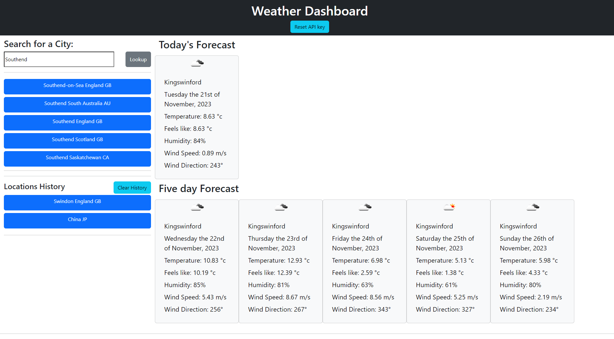

# Weather-Search
A simple dynamic page that uses openweathermap.org apis to generate a forecast dashboard given a particular city name to query against


## Description

This webpage demonstrates my ability to use some javascript logic to dynamically generate html for an interactive weather dashboard

## Table of Contents

Included for your ease of use is a table of contents

- [Installation](#installation)
- [Usage](#usage)
- [Credits](#credits)
- [Screenshots](#screenshots)
- [License](#license)

## Installation
  
If you wish to work on the files for this project you can clone it onto your machine and run it using the file protocol. It is easy to run aslong as you have an active openweathermap.org api key that you can supply to it. 
  
```Git clone command```  
```
git clone git@github.com:kevinstaresdarbon/Weather-Search.git
```
  
if you simply wish to view the page you can use this link:  
[Weather_Search](https://kevinstaresdarbon.github.io/Weather-Search/)

## Usage
  
This webpage is mainly for instructional purposes but also provides an interactive weather dashboard.
  
## Credits
  
The starter code at the initial starter commit, HTML and CSS was provided by the staff of edX.  
All commits after that is original work done by myself.  
No collaboration was needed or taken on this repository and code.  
  
The template and advice for this README was taken from this site:  
<https://coding-boot-camp.github.io/full-stack/github/professional-readme-guide>  
  
## Screenshots  
  
Below are the screenshots of the finished challenge:
  
Above 1200px wide:  
  
 

## License  
  
MIT License citation is supplied [HERE](./LICENSE)